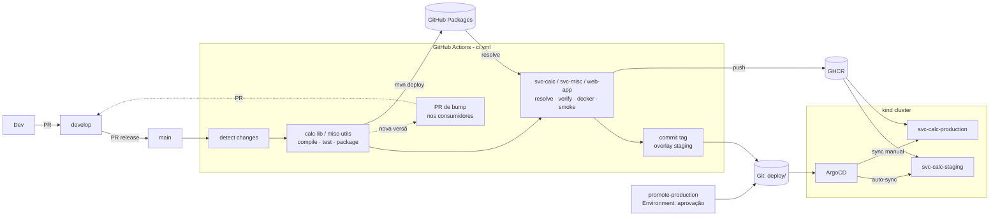
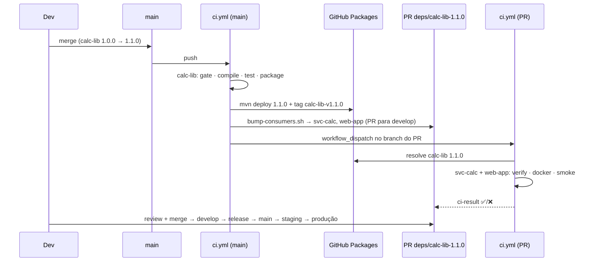

# SOLUTION — Infraestrutura de entrega VMETRIX

Pipeline de CI/CD que leva os 5 módulos (`calc-lib`, `misc-utils`, `svc-calc`, `svc-misc`,
`web-app`) de um commit até um ambiente pronto para produção, com GitOps (ArgoCD) para o `svc-calc`.

| | |
|---|---|
| CI | GitHub Actions (`.github/workflows/`) |
| Bibliotecas | GitHub Packages (Maven) + artifact do run |
| Imagens | GHCR `ghcr.io/kaiqueimoreira/<serviço>:<versão>-<sha7>` |
| GitOps | ArgoCD em kind, Kustomize, `staging` (auto) e `production` (aprovação + sync manual) |
| Código das aplicações | **Nenhum arquivo em `*/src` ou `*/pom.xml` foi alterado** |

**Sumário:** [1. Arquitetura](#1-arquitetura) · [2. Repositório, branches e versionamento](#2-repositório-branches-e-versionamento) ·
[3. Pipelines](#3-pipelines) · [4. GitOps com ArgoCD](#4-gitops-com-argocd) ·
[5. Ferramentas e justificativas](#5-ferramentas-e-justificativas) · [6. Credenciais](#6-credenciais-e-segurança) ·
[7. Reproduzir do zero](#7-reproduzir-o-ambiente-do-zero) · [8. Operação (runbooks)](#8-operação--runbooks) ·
[9. Segunda iteração](#9-segunda-iteração) · [ADRs](#adrs)

---

## 1. Arquitetura

### Visão ponta a ponta



### Grafo de jobs do `ci.yml` (a ordem de build é garantida por `needs:`)

```
changes ─┬─► calc-lib ───┬─► svc-calc ──► deploy-staging-svc-calc
         │               ├─► web-app ◄──┐
         ├─► misc-utils ─┼─► svc-misc   │
         │               └──────────────┘
         ├─► manifests (kustomize + kubeconform)
         │
         └  calc-lib   (publicou versão nova) ─► bump-calc-lib   ─► PR deps/calc-lib-X
            misc-utils (publicou versão nova) ─► bump-misc-utils ─► PR deps/misc-utils-X
todos ──► ci-result  (único check obrigatório da proteção de branch)
```

- Serviço só roda se a biblioteca da qual depende **passou ou não precisou rodar**. Se a lib falhar,
  o serviço é pulado e `ci-result` fica vermelho.
- Jobs pulados porque o módulo não mudou **não** bloqueiam o PR, porque o check obrigatório é o `ci-result`.

### Estrutura do repositório

```
.
├── calc-lib/  misc-utils/  svc-calc/  svc-misc/  web-app/   # código original, intocado
├── .github/
│   ├── workflows/
│   │   ├── ci.yml                 # orquestrador (DAG)
│   │   ├── _lib.yml               # pipeline reutilizável de biblioteca
│   │   ├── _service.yml           # pipeline reutilizável de serviço
│   │   ├── _bump-consumers.yml    # PR automático após nova versão de lib
│   │   └── promote.yml            # promoção/rollback para produção
│   ├── actions/gitops-set-image/  # composite: grava tag no overlay e faz commit
│   └── maven-settings.xml         # repositório GitHub Packages (credenciais via env)
├── ci/                            # scripts usados pelo pipeline (testáveis localmente)
│   ├── detect-changes.sh
│   ├── lib-version-gate.sh
│   ├── install-run-libs.sh
│   └── bump-consumers.sh
├── docker/Dockerfile              # imagem única para os 3 serviços
├── deploy/
│   ├── svc-calc/base/             # Deployment + Service
│   ├── svc-calc/overlays/{staging,production}/
│   └── argocd/{bootstrap/root-app.yaml, apps/*.yaml}
├── scripts/                       # bootstrap do cluster kind + ArgoCD
└── docs/adr/
```

---

## 2. Repositório, branches e versionamento

### Monorepo

Um repositório com um pipeline orquestrador. O porquê está no [ADR-001](docs/adr/ADR-001-monorepo-pipeline-orquestrador.md):
dependências lib → serviço explícitas num único grafo, mudança lib + consumidor validada num PR só,
e um run mostrando tudo ponta a ponta.

### Branches

```
feature/*  ──PR──►  develop  ──PR (release)──►  main
                       ▲                         │
                       └── deps/<lib>-<versão> ◄─┘ (PR aberto pelo pipeline)
```

| Branch | Papel | O que o CI faz |
|---|---|---|
| `feature/*`, `deps/*` | trabalho | PR → valida módulos alterados (build, testes, docker build, smoke test). Nada é publicado |
| `develop` | integração | idem, a cada push |
| `main` | produção | publica libs com versão nova, publica imagens, atualiza **staging** via GitOps. **Produção** só via `promote-production` |

Proteção (rulesets) em `main` e `develop`: PR obrigatório, check `ci-result` obrigatório, sem force push
e sem deleção. A única exceção é a deploy key `gitops-bot`, usada pelos jobs de deploy para gravar a tag
no overlay (ver seção 7.3).

### Versionamento

| Artefato | Versão | Onde é definida | Imutável? |
|---|---|---|---|
| `calc-lib`, `misc-utils` | SemVer, **independente** dos serviços | `<version>` do pom da lib | Sim: `lib-version-gate.sh` bloqueia republicação e o GitHub Packages retorna 409 |
| Dependência de lib em cada serviço | fixa, sem ranges e sem SNAPSHOT | `<calc-lib.version>` / `<misc-utils.version>` no pom do serviço | Muda só por PR |
| Tag git de lib | `calc-lib-v1.1.0` | criada pelo CI ao publicar | — |
| Imagem de serviço | `<versão-pom>-<sha7>` + `sha-<sha>` | calculada no CI | Sim; **nunca `latest`** |

Regras que o pipeline aplica:
- Mudou `calc-lib/**` e a versão do pom já está publicada? **PR falha** pedindo bump.
- `-SNAPSHOT` na `main`? **Falha.**
- Mudou só o pipeline (`.github/`, `ci/`, `docker/`)? Tudo é revalidado e nada é republicado.

### Como uma mudança de biblioteca chega aos consumidores

Detalhes e alternativas no [ADR-003](docs/adr/ADR-003-propagacao-versao-bibliotecas.md).



Também é possível mudar lib **e** consumidores no mesmo PR: o job da lib publica o JAR como artifact
do run e os jobs de serviço o instalam antes de resolver dependências
([ADR-002](docs/adr/ADR-002-distribuicao-bibliotecas.md)).

---

## 3. Pipelines

### 3.1 Bibliotecas — `_lib.yml`

| # | Step | Detalhe |
|---|---|---|
| 1 | Gate de versão | `ci/lib-version-gate.sh` consulta o GitHub Packages |
| 2 | `mvn compile` | |
| 3 | `mvn test` | falhou ⇒ job para; relatórios Surefire vão como artifact mesmo em falha |
| 4 | `mvn package -DskipTests` | os testes já rodaram no passo 3 |
| 5 | Upload artifact `lib-<modulo>` | JAR + sources + pom, 30 dias |
| 6 | `mvn deploy` *(main, versão nova)* | `-DaltDeploymentRepository`, sem alterar o pom |
| 7 | Tag git `<lib>-v<versão>` *(main)* | |

**Nenhum JAR que falhou em testes avança:** publish e artifact ficam no mesmo job, depois de `test`,
e jobs de serviço só rodam se o job da lib não falhou.

### 3.2 Serviços — `_service.yml`

| # | Step | Detalhe |
|---|---|---|
| 1 | Resolução de dependências | baixa `lib-*` do run atual (se houver) → `install-run-libs.sh` → `mvn dependency:resolve` (restante do GitHub Packages) → `dependency:tree` das libs internas |
| 2 | `mvn verify` | compila e roda os testes de integração (`@SpringBootTest` + MockMvc) |
| 3 | `docker build` | `docker/Dockerfile`: JRE 17, fat-jar em camadas, usuário não-root 10001; cache de layers do GHA |
| 4 | Smoke test | sobe o container e espera `/actuator/health` = `UP` |
| 5 | `docker push` *(main)* | `ghcr.io/<owner>/<svc>:<versão>-<sha7>` e `:sha-<sha>` |

Rastreabilidade da imagem (labels OCI):
`org.opencontainers.image.revision=<sha>`, `org.opencontainers.image.source=<repo>`,
`com.vmetrix.internal-libs=calc-lib:1.0.0`, `com.vmetrix.ci-run=<url do run>`.

```bash
docker buildx imagetools inspect ghcr.io/kaiqueimoreira/svc-calc:<tag> --format '{{json .Image.Config.Labels}}'
```

### 3.3 Por que o JAR é construído fora do Docker

O Maven roda no runner, com cache, e a imagem só copia o JAR já testado. Assim o `docker build` não
precisa de credencial do GitHub Packages (nenhum segredo em build-arg ou layer) e o artefato testado
é exatamente o que vai para a imagem.

---

## 4. GitOps com ArgoCD

Serviço escolhido: **`svc-calc`**, que não depende de outros serviços em runtime. Detalhes no
[ADR-004](docs/adr/ADR-004-gitops-promocao-producao.md).

| | staging | production |
|---|---|---|
| Application | `svc-calc-staging` | `svc-calc-production` |
| Namespace | `svc-calc-staging` | `svc-calc-production` |
| Overlay | `deploy/svc-calc/overlays/staging` | `deploy/svc-calc/overlays/production` |
| Réplicas / recursos | 1 · 256Mi/512Mi | 2 · 384Mi/768Mi · PDB `minAvailable: 1` · topology spread |
| Quem muda a tag | job `deploy staging` do `ci.yml`, a cada build na main | workflow `promote-production` |
| Sync | **automático** (`prune` + `selfHeal`) | **manual** |
| Aprovação | — | GitHub Environment `production` (revisor obrigatório) + Sync no ArgoCD |

Base comum: probes `startup`/`liveness`/`readiness` no Actuator, `readOnlyRootFilesystem`,
`runAsNonRoot`, `drop: ALL`, `maxUnavailable: 0`.

App-of-apps: só `deploy/argocd/bootstrap/root-app.yaml` é aplicado à mão. Ele gerencia o
`AppProject vmetrix` e as duas Applications em `deploy/argocd/apps/`. O AppProject restringe o
repositório de origem, os namespaces `svc-calc-*` e os tipos de recurso permitidos.

### Fluxo de deploy

1. Merge na `main` com mudança em `svc-calc` → imagem `1.0.0-abc1234` no GHCR.
2. CI faz commit `deploy(svc-calc/staging): <anterior> -> 1.0.0-abc1234` → ArgoCD sincroniza staging.
3. **Actions → promote-production → Run workflow** (tag vazia = a de staging).
4. Revisor aprova no Environment `production` → commit `deploy(svc-calc/production): ...`.
5. `svc-calc-production` fica **OutOfSync** → `argocd app sync svc-calc-production` (ou botão Sync na UI).

### Rollback (sem novo build)

| Situação | Como |
|---|---|
| Padrão (fica registrado no Git) | Actions → **promote-production** → `tag=<tag anterior>` → aprovar → Sync. A tag anterior está no `git log -p deploy/svc-calc/overlays/production` e no resumo do run anterior |
| Alternativa via Git | `git revert <commit deploy(svc-calc/production)>` via PR → Sync |
| Emergência (CI indisponível) | `argocd app history svc-calc-production` → `argocd app rollback svc-calc-production <ID>`. Depois, alinhar o Git com uma das opções acima, senão o próximo Sync reaplica a versão ruim |
| Staging | `git revert` do commit de deploy de staging (auto-sync aplica) |

---

## 5. Ferramentas e justificativas

| Função | Escolha | Por quê | Alternativas descartadas |
|---|---|---|---|
| Repositório | GitHub (monorepo) | CI, registry de pacotes, registry de imagens, environments com aprovação e proteção de branch no mesmo lugar, com identidade única (`GITHUB_TOKEN`) | GitLab (equivalente, mas sem ganho aqui); multi-repo (ADR-001) |
| CI | **GitHub Actions** | Nativo no repo; `needs:` modela o grafo de dependências; workflows reutilizáveis; `GITHUB_TOKEN` efêmero com permissões por job; Environments para gates | Jenkins (servidor para operar e proteger, fora do escopo); GitLab CI (exigiria mover o repo) |
| Artefatos de biblioteca | **GitHub Packages (Maven)** + artifact do run | Versões imutáveis, autenticação sem segredo estático, consumo por devs locais; artifact cobre lib + consumidor no mesmo PR (ADR-002) | Só artifacts (expiram, cross-run é frágil); Nexus (infra extra) |
| Registry de imagens | **GHCR** | Mesmo token/permissões do CI; imagem ligada ao repo pelo label `source`; sem conta extra | Docker Hub (conta e token separados, rate limit); ECR/GAR (exigem cloud) |
| Manifests | **Kustomize** | Base + overlays é o suficiente para 2 ambientes de 1 serviço; nativo no `kubectl` e no ArgoCD; `images.newTag` é fácil de editar pelo CI | Helm (templating desnecessário para 1 serviço interno; seria a escolha para empacotar para terceiros) |
| GitOps | **ArgoCD** (requisito) | App-of-apps, AppProject com RBAC, histórico e rollback | — |
| Cluster | **kind** | Reproduzível só com Docker, sem conta de cloud; mesma API do Kubernetes real | minikube/k3d (equivalentes) |
| Validação de manifests | `kubectl kustomize` + **kubeconform** | Pega erro de schema no PR, antes do ArgoCD | — |

---

## 6. Credenciais e segurança

**Nenhuma credencial está versionada.**

| Onde | Credencial | Como |
|---|---|---|
| Maven no CI (ler/publicar libs) | `GITHUB_TOKEN` | Efêmero por run; `maven-settings.xml` lê `${env.GITHUB_TOKEN}`; `packages: write` só nos jobs que precisam |
| GHCR (push) | `GITHUB_TOKEN` | `docker/login-action`, só quando `push: true` |
| Commit GitOps na `main` | Deploy key `gitops-bot` (escrita), secret `GITOPS_DEPLOY_KEY` | Secret **de Environment** (`staging` e `production`): só jobs desses ambientes a recebem, e o de produção só após aprovação. É o único ator no bypass do ruleset da `main` |
| PR de bump | `GITHUB_TOKEN` | `contents: write` / `pull-requests: write` só nesse job |
| Permissões default | `contents: read` | Top-level do `ci.yml`, elevadas por job (least privilege) |
| Pull de imagem no kind | nenhuma se os pacotes GHCR forem públicos; senão `GHCR_USER`/`GHCR_TOKEN` (PAT `read:packages`) em variável de ambiente do `bootstrap-cluster.sh`, virando Secret só no cluster | |
| ArgoCD admin | senha inicial gerada pelo ArgoCD (Secret no cluster) | |
| Dev local lendo libs do GitHub Packages | PAT `read:packages` em `~/.m2/settings.xml` do próprio dev | |

Outras medidas: imagem não-root com rootfs read-only, `concurrency` para não intercalar commits de deploy,
aprovação obrigatória no Environment `production`, AppProject limitando o raio de ação do ArgoCD.

---

## 7. Reproduzir o ambiente do zero

### 7.1 Pré-requisitos

| Ferramenta | Uso | Instalação (macOS) |
|---|---|---|
| Conta GitHub | repo, Actions, Packages, GHCR | — |
| `git`, `gh` | fork e configuração | `brew install git gh` |
| Docker | kind | Docker Desktop / OrbStack / Colima |
| `kind`, `kubectl` | cluster | `brew install kind kubectl` |
| `argocd` *(opcional)* | CLI | `brew install argocd` |

Java/Maven locais **não** são necessários: tudo compila no CI.

### 7.2 Repositório

```bash
# 1. Fork/clone e aponte os manifests para o SEU usuário (imagens e repoURL do ArgoCD)
gh repo fork kaiqueimoreira/vmetrix-devops-challenge --clone && cd vmetrix-devops-challenge
scripts/set-owner.sh <seu-usuario>
git commit -am "chore: owner do fork" && git push origin main

# 2. Branch de integração
git push origin main:develop
```

### 7.3 Configurações do GitHub (uma vez)

Via UI ou `gh api`:

1. **Actions → General → Workflow permissions:** "Read and write" e
   ✅ *Allow GitHub Actions to create and approve pull requests* (PR de bump).
   ```bash
   gh api -X PUT repos/<owner>/vmetrix-devops-challenge/actions/permissions/workflow \
     -f default_workflow_permissions=write -F can_approve_pull_request_reviews=true
   ```
2. **Environments:** criar `production` com *Required reviewers* = você/time; `staging` sem regras.
   ```bash
   gh api -X PUT repos/<owner>/vmetrix-devops-challenge/environments/production \
     --input - <<<'{"reviewers":[{"type":"User","id":'"$(gh api user -q .id)"'}]}'
   ```
3. **Deploy key do bot GitOps.** O `GITHUB_TOKEN` não pode entrar no bypass de ruleset, então os jobs
   de deploy fazem checkout com uma deploy key de escrita:
   ```bash
   ssh-keygen -t ed25519 -N "" -C gitops-bot -f ./gitops_key
   gh repo deploy-key add ./gitops_key.pub --allow-write --title gitops-bot
   gh secret set GITOPS_DEPLOY_KEY --env staging    < ./gitops_key
   gh secret set GITOPS_DEPLOY_KEY --env production < ./gitops_key
   rm ./gitops_key ./gitops_key.pub
   ```
4. **Ruleset** na `main`: PR obrigatório, status check `ci-result`, bloquear force push/deleção.
   *Bypass:* somente **Deploy keys** (Settings → Rules → Rulesets → Bypass list → Add bypass → Deploy keys).
   Commits feitos com a deploy key disparam workflows, mas o `ci.yml` ignora pushes que só alteram `deploy/**`.
5. **Primeiro run:** o push da etapa 7.2 dispara o `ci.yml` na `main`. Como é o primeiro push, todos os
   módulos rodam, as libs `1.0.0` são publicadas antes dos serviços e o staging recebe a primeira tag.
6. **Pacotes GHCR:** após o primeiro run, em *Packages → svc-calc → Package settings → Change visibility*
   marque **Public** (ou use `GHCR_TOKEN` no passo 7.4).

### 7.4 Cluster + ArgoCD

```bash
scripts/bootstrap-cluster.sh
# se os pacotes GHCR forem privados:
# GHCR_USER=<usuario> GHCR_TOKEN=<PAT read:packages> scripts/bootstrap-cluster.sh
```

O script cria o cluster kind `vmetrix`, instala o ArgoCD (versão fixa), aplica o app-of-apps e imprime
a senha do admin.

```bash
kubectl -n argocd port-forward svc/argocd-server 8443:443      # UI: https://localhost:8443
kubectl -n argocd get applications
kubectl -n svc-calc-staging port-forward svc/svc-calc 8082:80
curl -s localhost:8082/actuator/health
curl -s -X POST localhost:8082/api/statistics/summary -H 'Content-Type: application/json' -d '{"values":[2,4,4,4,5,5,7,9]}'
```

> O cluster kind é local: o ArgoCD **puxa** do GitHub (polling a cada ~3 min, ou *Refresh* na UI) e não
> precisa ser exposto à internet. Para sync imediato: `argocd app get svc-calc-staging --refresh`.

### 7.5 Roteiro de demonstração

| Cenário | Como disparar | O que observar |
|---|---|---|
| Pipeline ponta a ponta | commit em `svc-calc/` via PR `develop` → `main` | DAG no Actions; imagem no GHCR; commit `deploy(svc-calc/staging)`; ArgoCD sincronizando |
| Nova versão de lib | PR mudando `calc-lib` + `<version>1.1.0</version>` → merge na main | `calc-lib` publica 1.1.0 → `bump-calc-lib` abre PR `deps/calc-lib-1.1.0` → CI roda `svc-calc` e `web-app` |
| Lib sem bump | PR mudando `calc-lib/src` sem alterar a versão | gate falha: "já está publicada… faça bump" |
| Teste quebrado | PR que quebra um teste de lib | `mvn test` falha; serviços dependentes **skipped**; `ci-result` ❌ |
| Produção | Actions → promote-production | aprovação pendente → aprovar → OutOfSync → Sync |
| Rollback | promote-production com a tag anterior | nenhum build; pods voltam para a imagem anterior |

---

## 8. Operação — runbooks

### `OutOfSync` sem ninguém ter mexido nos manifests

1. **Qual recurso e qual campo?** `argocd app diff svc-calc-production`, ou UI → *App Diff*.
2. **Produção?** OutOfSync é **esperado** depois de um `promote-production`: é o gate manual.
   Confirme com `git log -3 -- deploy/svc-calc/overlays/production`.
3. **Drift real** (alguém rodou `kubectl edit`/`scale`, HPA mexeu em `replicas`, admission webhook
   injetou campos): `kubectl get deploy svc-calc -o yaml` e `managedFields` mostram quem alterou.
   Correção: reverter via Sync. Se for um campo gerenciado legitimamente por outro controller, use
   `ignoreDifferences` na Application, com a justificativa no PR.
4. **Normalização:** mudança de versão do ArgoCD/Kustomize ou default preenchido pelo API server
   (ex.: `resources` `1000m` vs `1`). Resolve-se no manifest ou com `ignoreDifferences`.
5. Em staging o `selfHeal` corrige drift sozinho; se ficar alternando, há outro controller brigando
   pelo mesmo campo.

### Pod em `CrashLoopBackOff` depois de um deploy

1. **Estancar:** em produção, rollback imediato (seção 4) e investigação depois. Com
   `maxUnavailable: 0` e readiness probe, o rollout travado normalmente não derrubou as réplicas antigas.
2. `kubectl -n <ns> describe pod <pod>`: *Last State*, *Exit Code* (137 = OOMKilled → ver limits e
   `MaxRAMPercentage`; 1 = erro da aplicação), eventos (probe falhando, pull de imagem).
3. `kubectl -n <ns> logs <pod> --previous`: log do container que morreu (stack trace do Spring).
4. **O que mudou?** `git log -p deploy/svc-calc/` (tag e config) e o label `com.vmetrix.internal-libs`
   da imagem nova vs anterior. Uma lib nova é suspeita número 1.
5. **Probe agressiva?** Se a app sobe mas é morta durante o boot, ajuste `startupProbe.failureThreshold`.
6. Reproduzir localmente: `docker run ghcr.io/<owner>/svc-calc:<tag>`, a mesma imagem.

### Push direto na `main` saltando o pipeline

- **Prevenir:** ruleset em `main` com PR obrigatório, `ci-result` obrigatório, sem force push,
  *Do not allow bypassing* para humanos (incluindo admins), bypass só para o bot e só para `deploy/**`.
  Opcional: *Require signed commits* e CODEOWNERS com review de `.github/` e `deploy/`.
- **Detectar:** audit log do repo/org e alerta para eventos `protected_branch.policy_override`.
- **Mitigar:** mesmo com push direto, o `ci.yml` roda no push e nada chega à produção sem o
  `promote-production` aprovado e o Sync manual.

### Garantir que `svc-calc` e `web-app` usam a nova `calc-lib` antes da produção

Ver seção 2 e ADR-003. Resumo: versão fixa no pom, PR de bump automático com CI verde obrigatório,
e cada imagem carrega no label a versão exata das libs.

---

## 9. Segunda iteração

1. **Gerar o grafo automaticamente** a partir dos poms (matriz dinâmica), sem jobs escritos à mão no `ci.yml`.
2. **Deploy dos outros serviços** (`svc-misc`, `web-app`) com ApplicationSet + Helm chart comum;
   `web-app` com `SVC_*_URL` apontando para os Services do cluster.
3. **Testes de contrato / compatibilidade**: rodar os testes dos consumidores contra a lib *antes* de
   publicá-la, no próprio PR da lib, e não só no PR de bump.
4. **Supply chain**: SBOM (Syft), scan de vulnerabilidades (Trivy) bloqueante para CRITICAL,
   assinatura de imagens com cosign keyless e política de verificação no cluster (Kyverno).
5. **GitHub App** no lugar do `GITHUB_TOKEN` para commits de deploy e PRs de bump: dispara workflows
   nativamente, sem `workflow_dispatch`, e dá um bypass de ruleset mais granular.
6. **Argo Rollouts** (canary com análise de métricas) e **ArgoCD Notifications** (Slack no sync/degraded).
7. **Observabilidade**: Prometheus scraping do Actuator, dashboards e alertas de SLO.
8. **Renovate** para dependências externas (Spring Boot, actions, imagens base) com pin por digest.
9. **Secrets** com External Secrets / Sealed Secrets quando os serviços tiverem configuração sensível.
10. **Release notes/versionamento** automatizados (Conventional Commits + release-please) para as libs.
11. Cluster de verdade (EKS/GKE) com Terraform e ArgoCD exposto via Ingress + SSO.

---

## ADRs

- [ADR-001 — Monorepo com pipeline orquestrador (DAG via `needs:`)](docs/adr/ADR-001-monorepo-pipeline-orquestrador.md)
- [ADR-002 — Distribuição das bibliotecas: GitHub Packages + artifact da execução](docs/adr/ADR-002-distribuicao-bibliotecas.md)
- [ADR-003 — Propagação de versão: versões fixas + PR automático de bump](docs/adr/ADR-003-propagacao-versao-bibliotecas.md)
- [ADR-004 — GitOps: CI escreve a tag; produção com gate duplo e sync manual](docs/adr/ADR-004-gitops-promocao-producao.md)

## Alterações no código das aplicações

Nenhuma. Os poms e o código em `src/` estão como recebidos. Repositório Maven, destino de deploy e
empacotamento Docker foram resolvidos fora dos módulos (`.github/maven-settings.xml`,
`-DaltDeploymentRepository`, `docker/Dockerfile`). O pom **só** muda pelo fluxo normal de bump de
versão de biblioteca.
